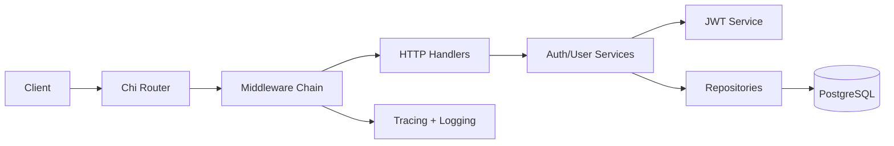
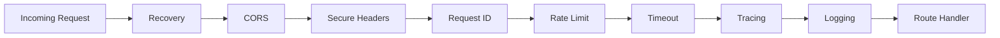
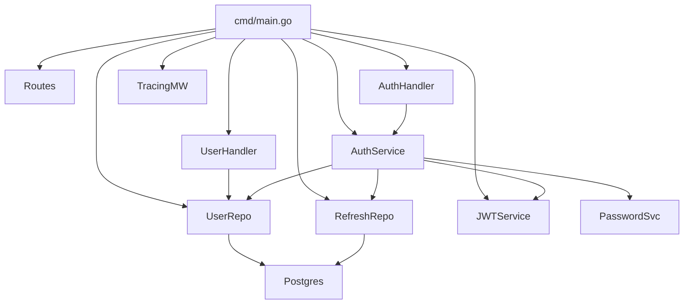
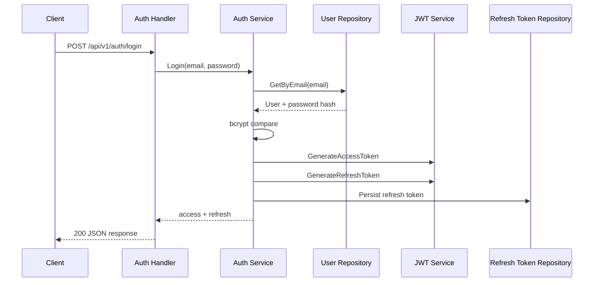
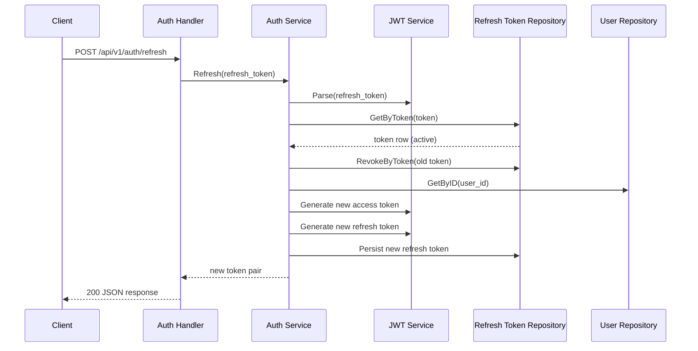
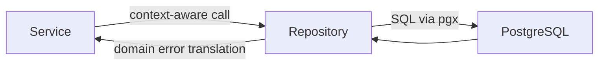
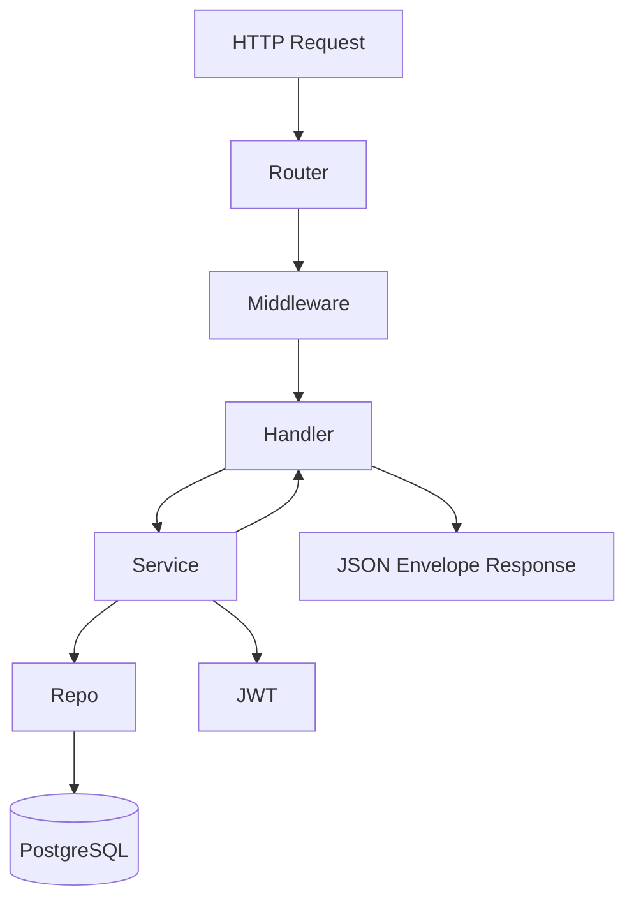

# Auth Service Architecture

## Overview

The auth-service is a dedicated identity boundary for the e-commerce platform. It owns user registration, credential verification, token issuance, token rotation, and authenticated identity lookup. The design favors explicit dependencies, small layers, and operational visibility.

## Tech Stack

- Go, `net/http`, Chi
- PostgreSQL with pgx
- Goose migrations
- OpenTelemetry (traces + metrics instrumentation)
- `slog` structured logging
- Docker / Docker Compose

## Directory Structure

- `cmd/` - composition root and runtime bootstrap
- `internal/handler/` - HTTP decode/validate/response concerns
- `internal/service/` - business rules and token lifecycle
- `internal/repository/` - SQL persistence and DB error translation
- `internal/middleware/` - cross-cutting HTTP concerns
- `internal/token/` - JWT generation/parsing
- `internal/observability/` - logger and tracing initialization
- `internal/database/migrations/` - schema evolution

## Service Architecture

## Request Lifecycle

1. Request enters Chi router.
2. Global middleware enforces resilience/security and annotates context.
3. Handler validates input DTOs and invokes service methods.
4. Service executes business logic and coordinates repositories/token service.
5. Repository executes SQL with context propagation.
6. Handler emits standardized JSON response envelopes.

## Middleware Chain

Current global chain order:

1. Recovery
2. CORS
3. SecureHeaders
4. RequestID
5. RateLimit
6. Timeout
7. Tracing
8. Logging

## Dependency Graph

## Authentication Architecture

Repository/service separation exists to keep transport and persistence concerns isolated:

- Handlers remain thin and HTTP-focused.
- Services own business rules (credential validation, token lifecycle, rotation).
- Repositories remain focused on SQL interaction and error translation.

This keeps business logic testable independent of transport or storage details.

### Login Flow

### Refresh Token Rotation Flow

Refresh tokens are persisted so the service can revoke compromised sessions, enforce rotation, and invalidate old refresh tokens after use.

## Database Interaction Flow

- `pgx.ErrNoRows` is translated to domain-level auth errors.
- Unique-constraint violations are mapped to domain conflict errors.
- Raw database internals are not exposed to API consumers.

## Request Flow (End-to-End)

## Observability

- Trace spans are started per HTTP request and propagated through context.
- Request latency is recorded as a histogram metric.
- Structured logs include method, path, status, request ID, trace ID, and duration.
- Trace context propagates from middleware into handlers/services/repositories through `context.Context`.

## Security

- Passwords hashed with bcrypt.
- Short-lived access tokens reduce blast radius.
- Refresh tokens are persisted and revocable.
- Rotation invalidates previous refresh tokens after use.
- Security middleware includes rate limiting, secure headers, timeout, and panic recovery.

## Error Handling

- Domain errors represent business failures.
- HTTP error mapper converts domain errors to stable status codes/messages.
- Consistent error envelope avoids leaking low-level DB/runtime details.

## Scaling Considerations

- Stateless access-token validation supports horizontal scaling.
- Refresh token persistence centralizes session invalidation.
- In-memory rate limiting is instance-local; distributed limiter should be used for multi-instance deployments.
- Tracing and structured logs support cross-service debugging in distributed topologies.

## Future Improvements

- Move rate limiting to Redis-backed distributed counters.
- Add DB query-level telemetry via pgx tracing hooks.
- Add token family/session models for richer device-level revocation.
- Add SLO dashboards and alerting for auth latency/error budgets.
