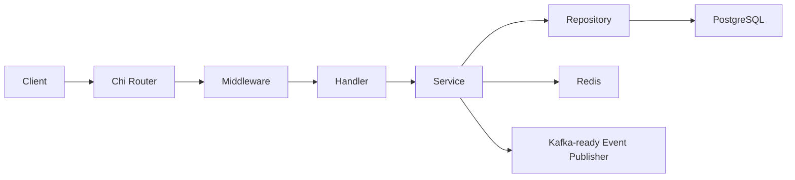
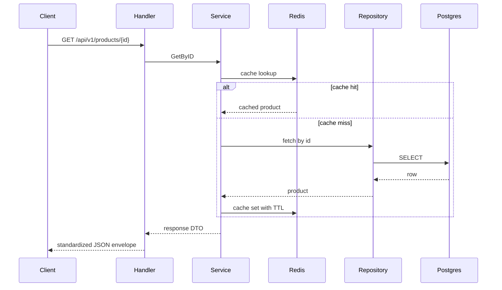

# Product Service Architecture

## Overview

`product-service` owns the product catalog boundary for the platform. It keeps HTTP transport, business rules, persistence, cache policy, and observability concerns separated into the same layers used by `auth-service`.

## Layering

- `cmd/` composes the application and wires dependencies.
- `internal/handler/` contains HTTP decode/validate/respond logic.
- `internal/service/` contains business logic, cache-aside reads, invalidation, and event hooks.
- `internal/repository/` contains PostgreSQL access and DB error translation.
- `internal/middleware/` contains request ID, logging, timeout, recovery, security, and tracing.
- `internal/observability/` initializes the logger and OTel provider.

## Runtime Flow

## Request Flow

## Middleware Chain

1. Recovery
2. CORS
3. Secure headers
4. Request ID
5. Rate limit
6. Timeout
7. Tracing
8. Logging

## Pagination Model

- Cursor pagination uses the `(created_at, id)` tuple.
- Sorting is stable and deterministic with `created_at` plus `id` as the tie-breaker.
- No offset pagination is used.
- The cursor is opaque to clients and encoded as base64.

## Caching Model

- Product detail reads use `product:detail:{id}`.
- Product list reads use a query-shape key that includes limit, cursor, category, sort, and search.
- Cache-aside is used for reads.
- Create/update/delete operations invalidate list caches; update/delete also invalidate the detail cache.

## Event Hooks

- `product.created`
- `product.updated`
- `inventory.updated`

The current implementation exposes the publishing contract without coupling the service to Kafka.

## Observability Notes

- HTTP spans are started by middleware.
- Repository methods and Redis operations create their own spans.
- Request latency is measured in a histogram metric.
- Logs carry `request_id` and `trace_id` for correlation.

## Future Work

- Kafka event publishing implementation
- distributed cache invalidation if the service becomes multi-instance with shared write traffic
- richer dashboards and alerting for inventory and catalog latency
